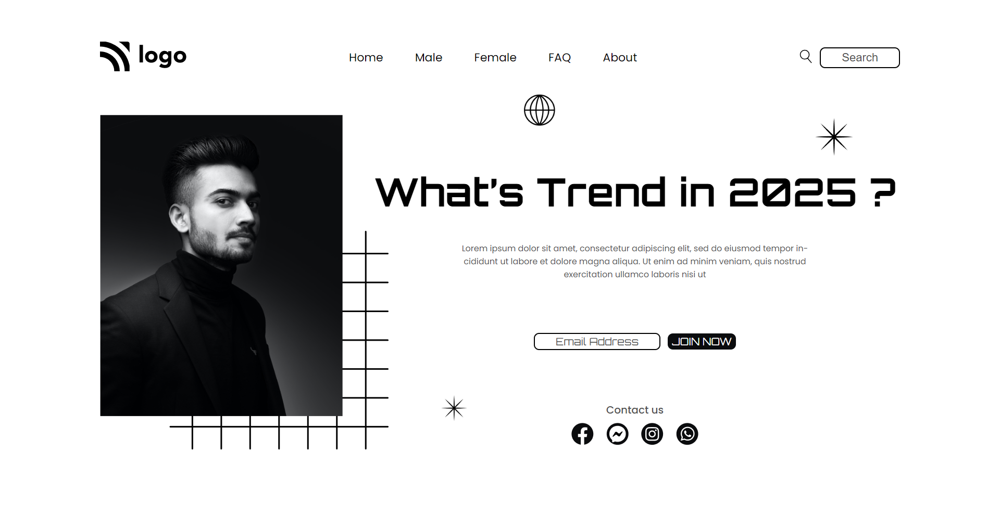

# Street Style Landing Page | Project-1 

Hello There,

I'm `Adnan Sarkar`. This is the first assignment in my [Full Stack Javascript](https://ineuron.ai/course/Full-Stack-Javascript-Web-Developer) course. Where I designed this page using raw HTML & CSS. This design is not responsive, because at first, I prove to myself that I'm comfortable designing anything using raw HTML-CSS. It looks perfect on screen size `1920 x 1080`.

## 🛠 Technologies Used
- HTML
- CSS

## 🖥 Preview
[Live Preview](https://street-style-landing-page-project-1.netlify.app/)

##  What I have learned in this project?
- Flex-box for elements alignment.
- Clear understanding of CSS positioning property.

## ⏲ Time to finish the project
As it is my first project, it took me around 3-4 hours to complete this project.

## 📢 Social Links
- 
- 
- 
- 
- 